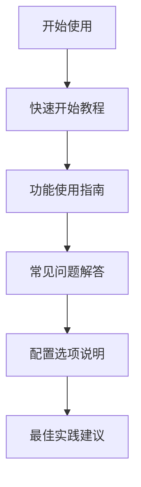
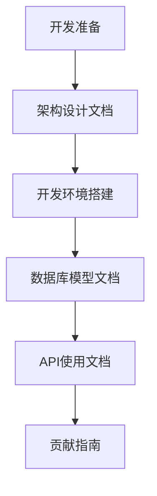
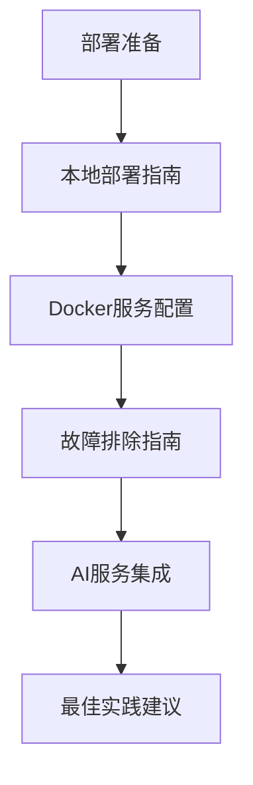

# Whisper App 完整文档索引

本文档汇总了 Whisper App 项目的所有文档，提供快速导航和文档概览。

## 📚 文档总览

本项目包含 **15个核心文档**，涵盖部署、使用、技术和开发的各个方面：

### 🎯 文档统计

| 类别 | 文档数量 | 总计字数 | 涵盖内容 |
|------|----------|----------|----------|
| **主要文档** | 4 | ~25,000字 | 部署、快速开始、故障排除、API |
| **技术文档** | 4 | ~30,000字 | 架构、数据库、AI集成、Docker |
| **用户文档** | 4 | ~20,000字 | 功能指南、FAQ、配置、最佳实践 |
| **开发者文档** | 2 | ~8,000字 | 开发环境、贡献指南 |
| **总计** | **15** | **~85,000字** | **完整技术文档体系** |

## 🚀 主要文档 (main/)

### 1. [本地部署完整指南](./main/LOCAL_DEPLOYMENT_GUIDE.md)
**字数**: ~8,000字 | **难度**: ⭐⭐⭐
- 系统要求和预安装准备
- 详细的一步步部署流程
- 服务配置和环境变量说明
- 验证部署和常见问题解决

### 2. [快速开始教程](./main/QUICK_START_GUIDE.md)
**字数**: ~5,000字 | **难度**: ⭐
- 5分钟快速部署
- 第一次使用指南
- 核心功能介绍
- 使用技巧和最佳实践

### 3. [故障排除指南](./main/TROUBLESHOOTING_GUIDE.md)
**字数**: ~8,000字 | **难度**: ⭐⭐
- 快速诊断工具和方法
- 部署、服务、转录、AI处理问题
- 性能优化和错误处理
- 深度故障排除技巧

### 4. [API使用文档](./main/API_REFERENCE.md)
**字数**: ~6,000字 | **难度**: ⭐⭐⭐
- REST API和tRPC接口完整说明
- 认证机制和错误处理
- 详细的使用示例和SDK
- 高级功能和集成方案

## 🔧 技术文档 (technical/)

### 1. [架构设计文档](./technical/ARCHITECTURE.md)
**字数**: ~10,000字 | **难度**: ⭐⭐⭐⭐
- 系统架构和设计原则
- 技术栈选型和组件说明
- 数据流设计和通信机制
- 扩展性设计和未来规划

### 2. [数据库模型文档](./technical/DATABASE_SCHEMA.md)
**字数**: ~8,000字 | **难度**: ⭐⭐⭐
- 完整的数据库设计说明
- 表结构、关系和索引策略
- 查询优化和性能调优
- 数据迁移和备份策略

### 3. [AI服务集成文档](./technical/AI_INTEGRATION.md)
**字数**: ~8,000字 | **难度**: ⭐⭐⭐⭐
- Whisper语音识别集成详解
- Ollama大语言模型配置
- 模型管理和性能优化
- 错误处理和扩展开发

### 4. [Docker服务配置文档](./technical/DOCKER_SERVICES.md)
**字数**: ~8,000字 | **难度**: ⭐⭐⭐
- 完整的容器化架构说明
- 服务配置和网络管理
- 健康检查和资源限制
- 生产环境优化配置

## 👥 用户文档 (user/)

### 1. [功能使用指南](./user/FEATURES_GUIDE.md)
**字数**: ~8,000字 | **难度**: ⭐⭐
- 所有功能的详细使用说明
- 音频上传和转录流程
- AI智能处理和自定义模板
- 数据管理和导出功能

### 2. [常见问题解答](./user/FAQ.md)
**字数**: ~6,000字 | **难度**: ⭐
- 用户最常遇到的问题和解答
- 按类别组织的问题索引
- 实用的解决方案和技巧
- 技术支持和帮助资源

### 3. [配置选项说明](./user/CONFIGURATION.md)
**字数**: ~4,000字 | **难度**: ⭐⭐⭐
- 所有环境变量和配置项说明
- 应用、数据库、AI、存储配置
- 安全、性能、日志配置
- 配置验证和测试方法

### 4. [最佳实践建议](./user/BEST_PRACTICES.md)
**字数**: ~6,000字 | **难度**: ⭐⭐
- 录音质量优化指南
- AI处理效果提升技巧
- 系统性能优化建议
- 安全和数据管理策略

## 💻 开发者文档 (developer/)

### 1. [开发环境搭建](./developer/DEVELOPMENT_SETUP.md)
**字数**: ~5,000字 | **难度**: ⭐⭐⭐
- 完整的开发环境配置指南
- 项目结构和工具配置
- 调试、测试和开发流程
- Git工作流和发布流程

### 2. [贡献指南](./developer/CONTRIBUTING.md)
**字数**: ~1,000字 | **难度**: ⭐
- 如何参与项目贡献
- 代码规范和提交格式
- 问题报告和功能请求
- 开发优先级和获取帮助

## 🗺️ 文档使用路径

### 新用户推荐阅读顺序

**时间投入**: 2-3小时完成基础学习

### 开发者推荐阅读顺序

**时间投入**: 4-6小时完成开发准备

### 运维人员推荐阅读顺序

**时间投入**: 3-4小时完成部署掌握

## 📖 文档特色

### 🎯 实用性导向
- 每个文档都包含实际可执行的命令和示例
- 提供完整的代码片段和配置文件
- 包含故障排除和最佳实践建议

### 🔄 持续更新
- 文档与代码同步更新
- 基于用户反馈持续改进
- 定期审查和优化内容结构

### 🌐 完整覆盖
- 从新手入门到专家级配置的全面覆盖
- 理论说明与实践指导并重
- 多角度视角：用户、开发者、运维

### 📱 易于导航
- 清晰的目录结构和交叉引用
- 搜索友好的标题和标签
- 难度等级和预估阅读时间

## 🔍 文档查找技巧

### 按问题类型查找

| 问题类型 | 首选文档 | 备选文档 |
|----------|----------|----------|
| **安装部署问题** | [本地部署指南](./main/LOCAL_DEPLOYMENT_GUIDE.md) | [故障排除指南](./main/TROUBLESHOOTING_GUIDE.md) |
| **功能使用问题** | [功能使用指南](./user/FEATURES_GUIDE.md) | [常见问题解答](./user/FAQ.md) |
| **性能优化问题** | [最佳实践建议](./user/BEST_PRACTICES.md) | [配置选项说明](./user/CONFIGURATION.md) |
| **开发集成问题** | [API使用文档](./main/API_REFERENCE.md) | [开发环境搭建](./developer/DEVELOPMENT_SETUP.md) |
| **系统架构问题** | [架构设计文档](./technical/ARCHITECTURE.md) | [Docker服务配置](./technical/DOCKER_SERVICES.md) |

### 按用户角色查找

| 用户角色 | 核心文档 | 扩展阅读 |
|----------|----------|----------|
| **终端用户** | 快速开始 → 功能指南 → FAQ | 最佳实践 → 配置说明 |
| **系统管理员** | 部署指南 → Docker配置 → 故障排除 | AI集成 → 数据库文档 |
| **开发人员** | 架构文档 → 开发环境 → API文档 | 数据库文档 → 贡献指南 |
| **运维工程师** | 部署指南 → 故障排除 → 最佳实践 | Docker配置 → 架构文档 |

## 📊 文档质量保证

### ✅ 内容审查标准
- **准确性**: 所有代码和命令经过实际验证
- **完整性**: 涵盖功能的完整生命周期
- **实用性**: 提供可行的解决方案
- **时效性**: 与最新版本代码同步

### 🔄 持续改进机制
- 用户反馈收集和处理
- 定期内容审查和更新
- 文档使用数据分析
- 社区贡献和协作

## 📞 文档反馈

### 如何提供反馈
- **GitHub Issues**: 报告文档错误或不准确信息
- **Pull Requests**: 直接提交文档改进
- **Discussions**: 讨论文档结构和内容建议

### 改进建议
- 指出不清楚或难以理解的部分
- 建议新增缺失的内容
- 提供使用案例和最佳实践
- 协助翻译和本地化

---

## 🎉 开始您的 Whisper App 之旅

选择适合您的文档开始阅读：

- 🚀 **快速体验**: [快速开始教程](./main/QUICK_START_GUIDE.md)
- 🏗️ **完整部署**: [本地部署指南](./main/LOCAL_DEPLOYMENT_GUIDE.md)  
- 📖 **深入学习**: [功能使用指南](./user/FEATURES_GUIDE.md)
- 💻 **开发集成**: [开发环境搭建](./developer/DEVELOPMENT_SETUP.md)

**祝您使用愉快！如有任何问题，欢迎查阅相关文档或在社区中提问。** 🌟