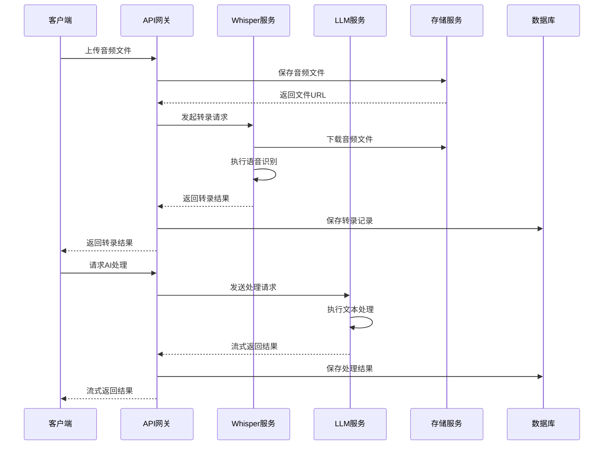

# Whisper App AI服务集成文档

本文档详细介绍了 Whisper App 的AI服务集成架构，包括本地Whisper语音识别、Ollama大语言模型和相关的优化策略。

## 📋 目录

1. [AI服务概览](#AI服务概览)
2. [Whisper语音识别](#Whisper语音识别)
3. [Ollama大语言模型](#Ollama大语言模型)
4. [服务集成架构](#服务集成架构)
5. [模型管理](#模型管理)
6. [性能优化](#性能优化)
7. [错误处理和容错](#错误处理和容错)
8. [监控和诊断](#监控和诊断)
9. [扩展和定制](#扩展和定制)

## 🤖 AI服务概览

Whisper App 集成了两个核心的AI服务：

### 服务架构
```
Audio Input → Whisper Service → Text Output → LLM Service → Processed Output
     ↓              ↓                ↓           ↓            ↓
  音频文件        语音识别         转录文本      文本处理      智能输出
```

### 技术选型

| 服务 | 技术 | 版本 | 用途 | 优势 |
|------|------|------|------|------|
| **语音识别** | OpenAI Whisper | latest | 音频转文字 | 高准确率、多语言支持 |
| **大语言模型** | Ollama | latest | 文本处理 | 本地部署、隐私保护 |
| **音频处理** | FFmpeg | 系统安装 | 音频预处理 | 格式转换、质量优化 |

### 部署模式
- **完全本地化**: 所有AI推理在本地执行
- **无数据外传**: 音频和文本数据不离开用户环境
- **离线工作**: 断网情况下仍可正常使用
- **GPU加速**: 支持NVIDIA GPU加速推理

## 🎤 Whisper语音识别

### 服务配置

**Docker容器配置**:
```yaml
# docker-compose.yml
ollama:
  image: ollama/ollama:latest
  container_name: whisper_ollama
  restart: unless-stopped
  ports:
    - "11434:11434"
  environment:
    - OLLAMA_HOST=0.0.0.0
  volumes:
    - ollama_data:/root/.ollama
  networks:
    - whisper_network
```

**环境变量配置**:
```bash
# .env.local
OLLAMA_BASE_URL="http://localhost:11434"
LOCAL_WHISPER_ENABLED=true
WHISPER_MODEL="whisper:latest"
```

### Whisper模型规格

| 模型 | 参数量 | 内存需求 | 速度 | 准确性 | 适用场景 |
|------|-------|----------|------|--------|----------|
| `tiny` | 39M | ~1GB | 最快 | 一般 | 快速测试、资源受限 |
| `base` | 74M | ~1GB | 快 | 良好 | 日常使用推荐 |
| `small` | 244M | ~2GB | 中等 | 很好 | 平衡性能和质量 |
| `medium` | 769M | ~5GB | 慢 | 优秀 | 高质量需求 |
| `large-v3` | 1550M | ~10GB | 最慢 | 最佳 | 专业级应用 |

### 核心服务实现

**LocalWhisperService类**:
```typescript
// lib/localWhisperService.ts
export class LocalWhisperService {
  private baseUrl: string;
  private model: string;

  constructor() {
    this.baseUrl = process.env.OLLAMA_BASE_URL || 'http://localhost:11434';
    this.model = process.env.WHISPER_MODEL || 'whisper:latest';
  }

  async transcribe(audioUrl: string, options?: TranscribeOptions): Promise<TranscribeResult> {
    try {
      // 1. 下载和预处理音频
      const audioBuffer = await this.downloadAudio(audioUrl);
      const processedAudio = await this.preprocessAudio(audioBuffer);

      // 2. 调用Whisper模型
      const response = await fetch(`${this.baseUrl}/api/generate`, {
        method: 'POST',
        headers: { 'Content-Type': 'application/json' },
        body: JSON.stringify({
          model: this.model,
          prompt: this.buildTranscriptionPrompt(options),
          images: [processedAudio.toString('base64')],
          stream: false
        })
      });

      // 3. 处理响应
      const result = await response.json();
      return this.parseTranscriptionResult(result);

    } catch (error) {
      throw new WhisperServiceError(`Transcription failed: ${error.message}`);
    }
  }

  private async downloadAudio(url: string): Promise<Buffer> {
    const response = await fetch(url);
    if (!response.ok) {
      throw new Error(`Failed to download audio: ${response.statusText}`);
    }
    return Buffer.from(await response.arrayBuffer());
  }

  private async preprocessAudio(buffer: Buffer): Promise<Buffer> {
    // 使用FFmpeg进行音频预处理
    return new Promise((resolve, reject) => {
      const ffmpeg = spawn('ffmpeg', [
        '-i', 'pipe:0',          // 从stdin读取
        '-ar', '16000',          // 采样率16kHz
        '-ac', '1',              // 单声道
        '-c:a', 'pcm_s16le',     // PCM 16位
        '-f', 'wav',             // WAV格式
        'pipe:1'                 // 输出到stdout
      ]);

      const chunks: Buffer[] = [];
      
      ffmpeg.stdout.on('data', (chunk) => chunks.push(chunk));
      ffmpeg.stdout.on('end', () => resolve(Buffer.concat(chunks)));
      ffmpeg.stderr.on('data', (data) => console.error('FFmpeg:', data.toString()));
      ffmpeg.on('error', reject);

      ffmpeg.stdin.write(buffer);
      ffmpeg.stdin.end();
    });
  }
}
```

### 转录选项配置

```typescript
interface TranscribeOptions {
  language?: string;           // 指定语言代码 (如 'zh', 'en')
  task?: 'transcribe' | 'translate';  // 任务类型
  temperature?: number;        // 随机性控制 (0-1)
  initial_prompt?: string;     // 初始提示
  vad_filter?: boolean;        // 语音活动检测
  no_speech_threshold?: number; // 静音阈值
}

// 使用示例
const result = await whisperService.transcribe(audioUrl, {
  language: 'zh',
  temperature: 0.1,
  vad_filter: true,
  initial_prompt: '这是一段中文录音'
});
```

### 语言支持

**支持的语言列表**:
```typescript
export const SUPPORTED_LANGUAGES = {
  'auto': '自动检测',
  'zh': '中文',
  'en': 'English',
  'es': 'Español',
  'fr': 'Français',
  'de': 'Deutsch',
  'ja': '日本語',
  'ko': '한국어',
  'ru': 'Русский',
  'ar': 'العربية',
  'hi': 'हिन्दी',
  // ... 更多语言
} as const;

export type LanguageCode = keyof typeof SUPPORTED_LANGUAGES;
```

## 🧠 Ollama大语言模型

### 模型管理

**支持的模型列表**:
```bash
# 下载推荐模型
docker exec whisper_ollama ollama pull llama3.1:8b        # 通用模型
docker exec whisper_ollama ollama pull qwen2:7b           # 中文优化
docker exec whisper_ollama ollama pull codellama:7b       # 代码处理
docker exec whisper_ollama ollama pull mistral:7b         # 轻量高效
```

**模型配置对比**:
| 模型 | 参数量 | 内存需求 | 中文支持 | 适用场景 |
|------|-------|----------|----------|----------|
| `llama3.1:8b` | 8B | ~8GB | 良好 | 通用文本处理 |
| `qwen2:7b` | 7B | ~7GB | 优秀 | 中文文本处理 |
| `mistral:7b` | 7B | ~7GB | 一般 | 高效推理 |
| `codellama:7b` | 7B | ~7GB | 一般 | 代码生成分析 |

### LLM服务实现

**LocalLLMService类**:
```typescript
// lib/localLLMService.ts
export class LocalLLMService {
  private baseUrl: string;
  private defaultModel: string;

  constructor() {
    this.baseUrl = process.env.OLLAMA_BASE_URL || 'http://localhost:11434';
    this.defaultModel = process.env.LOCAL_LLM_MODEL || 'llama3.1:8b';
  }

  async generate(prompt: string, options?: GenerateOptions): Promise<string> {
    const response = await fetch(`${this.baseUrl}/api/generate`, {
      method: 'POST',
      headers: { 'Content-Type': 'application/json' },
      body: JSON.stringify({
        model: options?.model || this.defaultModel,
        prompt: this.buildPrompt(prompt, options),
        stream: false,
        options: {
          temperature: options?.temperature || 0.7,
          top_p: options?.top_p || 0.9,
          max_tokens: options?.max_tokens || 2000,
        }
      })
    });

    const result = await response.json();
    return result.response;
  }

  async generateStream(prompt: string, options?: GenerateOptions): Promise<AsyncIterableIterator<string>> {
    const response = await fetch(`${this.baseUrl}/api/generate`, {
      method: 'POST',
      headers: { 'Content-Type': 'application/json' },
      body: JSON.stringify({
        model: options?.model || this.defaultModel,
        prompt: this.buildPrompt(prompt, options),
        stream: true,
        options: {
          temperature: options?.temperature || 0.7,
          top_p: options?.top_p || 0.9,
          max_tokens: options?.max_tokens || 2000,
        }
      })
    });

    return this.parseStreamResponse(response);
  }

  private buildPrompt(userPrompt: string, options?: GenerateOptions): string {
    const systemPrompt = options?.systemPrompt || '你是一个有用的AI助手。';
    
    return `<|begin_of_text|><|start_header_id|>system<|end_header_id|>
${systemPrompt}<|eot_id|><|start_header_id|>user<|end_header_id|>
${userPrompt}<|eot_id|><|start_header_id|>assistant<|end_header_id|>`;
  }

  private async *parseStreamResponse(response: Response): AsyncIterableIterator<string> {
    if (!response.body) throw new Error('No response body');

    const reader = response.body.getReader();
    const decoder = new TextDecoder();

    try {
      while (true) {
        const { done, value } = await reader.read();
        if (done) break;

        const chunk = decoder.decode(value);
        const lines = chunk.split('\n').filter(line => line.trim());

        for (const line of lines) {
          try {
            const data = JSON.parse(line);
            if (data.response) {
              yield data.response;
            }
            if (data.done) {
              return;
            }
          } catch (e) {
            // 忽略解析错误，继续处理下一行
          }
        }
      }
    } finally {
      reader.releaseLock();
    }
  }
}
```

### 提示模板系统

**预定义提示模板**:
```typescript
export const PROMPT_TEMPLATES = {
  summary: `请为以下文字生成简洁的摘要，突出主要观点和关键信息：

{transcription}

摘要：`,

  email: `请将以下语音转录内容转换为正式的邮件格式：

转录内容：{transcription}

邮件：`,

  meeting_notes: `请将以下会议转录整理为结构化的会议纪要：

转录内容：{transcription}

会议纪要：
1. 主要议题：
2. 关键决定：
3. 行动项目：
4. 下次会议：`,

  action_items: `请从以下转录内容中提取行动项目和待办事项：

转录内容：{transcription}

行动项目：`,

  custom: `{prompt}

转录内容：{transcription}

回答：`
} as const;

export type PromptType = keyof typeof PROMPT_TEMPLATES;
```

## 🔧 服务集成架构

### 服务交互流程



### 集成服务类

**AIServiceManager**:
```typescript
// lib/aiServiceManager.ts
export class AIServiceManager {
  private whisperService: LocalWhisperService;
  private llmService: LocalLLMService;
  private cache: Redis;

  constructor() {
    this.whisperService = new LocalWhisperService();
    this.llmService = new LocalLLMService();
    this.cache = new Redis(process.env.REDIS_URL);
  }

  async transcribeAudio(audioUrl: string, options?: TranscribeOptions): Promise<TranscribeResult> {
    // 检查缓存
    const cacheKey = this.generateCacheKey('transcribe', audioUrl, options);
    const cached = await this.cache.get(cacheKey);
    if (cached) {
      return JSON.parse(cached);
    }

    // 执行转录
    const result = await this.whisperService.transcribe(audioUrl, options);
    
    // 缓存结果
    await this.cache.setex(cacheKey, 3600, JSON.stringify(result));
    
    return result;
  }

  async processText(text: string, promptType: PromptType, customPrompt?: string): Promise<string> {
    const prompt = this.buildPrompt(text, promptType, customPrompt);
    
    // 检查缓存
    const cacheKey = this.generateCacheKey('process', text, promptType, customPrompt);
    const cached = await this.cache.get(cacheKey);
    if (cached) {
      return cached;
    }

    // 执行处理
    const result = await this.llmService.generate(prompt);
    
    // 缓存结果
    await this.cache.setex(cacheKey, 1800, result);
    
    return result;
  }

  async processTextStream(text: string, promptType: PromptType, customPrompt?: string): AsyncIterableIterator<string> {
    const prompt = this.buildPrompt(text, promptType, customPrompt);
    return this.llmService.generateStream(prompt);
  }

  private buildPrompt(text: string, promptType: PromptType, customPrompt?: string): string {
    const template = promptType === 'custom' && customPrompt 
      ? customPrompt 
      : PROMPT_TEMPLATES[promptType];
    
    return template.replace('{transcription}', text).replace('{prompt}', customPrompt || '');
  }

  private generateCacheKey(...args: any[]): string {
    const hash = crypto.createHash('md5');
    hash.update(JSON.stringify(args));
    return `ai_cache:${hash.digest('hex')}`;
  }
}
```

## 📈 模型管理

### 模型下载和更新

**模型管理脚本**:
```bash
#!/bin/bash
# scripts/management/ai-setup.sh

OLLAMA_BASE_URL=${OLLAMA_BASE_URL:-"http://localhost:11434"}

# 检查Ollama服务状态
check_ollama_status() {
    curl -f "$OLLAMA_BASE_URL/api/tags" >/dev/null 2>&1
    return $?
}

# 列出可用模型
list_models() {
    echo "本地已安装的模型："
    curl -s "$OLLAMA_BASE_URL/api/tags" | jq -r '.models[].name'
}

# 安装推荐模型
install_recommended_models() {
    echo "正在安装推荐的AI模型..."
    
    # Whisper模型
    echo "下载Whisper模型..."
    docker exec whisper_ollama ollama pull whisper:latest
    
    # 中文优化的LLM模型
    echo "下载中文LLM模型..."
    docker exec whisper_ollama ollama pull qwen2:7b
    
    # 通用LLM模型
    echo "下载通用LLM模型..."
    docker exec whisper_ollama ollama pull llama3.1:8b
    
    echo "模型安装完成！"
}

# 删除模型
remove_model() {
    local model_name=$1
    if [ -z "$model_name" ]; then
        echo "请指定要删除的模型名称"
        return 1
    fi
    
    docker exec whisper_ollama ollama rm "$model_name"
    echo "模型 $model_name 已删除"
}

# 交互式设置
interactive_setup() {
    echo "=== Whisper App AI模型设置 ==="
    echo "1. 安装推荐模型"
    echo "2. 列出已安装模型"
    echo "3. 删除模型"
    echo "4. 检查服务状态"
    echo "5. 退出"
    
    read -p "请选择操作 (1-5): " choice
    
    case $choice in
        1) install_recommended_models ;;
        2) list_models ;;
        3) 
            read -p "请输入要删除的模型名称: " model_name
            remove_model "$model_name"
            ;;
        4) 
            if check_ollama_status; then
                echo "✅ Ollama服务运行正常"
            else
                echo "❌ Ollama服务不可用"
            fi
            ;;
        5) exit 0 ;;
        *) echo "无效选择" ;;
    esac
}

# 主程序
main() {
    if [ "$#" -eq 0 ]; then
        interactive_setup
    else
        case "$1" in
            "list") list_models ;;
            "install") install_recommended_models ;;
            "remove") remove_model "$2" ;;
            "status") check_ollama_status ;;
            *) echo "用法: $0 [list|install|remove|status]" ;;
        esac
    fi
}

main "$@"
```

### 模型版本管理

```typescript
// lib/modelManager.ts
export class ModelManager {
  private ollamaUrl: string;

  constructor() {
    this.ollamaUrl = process.env.OLLAMA_BASE_URL || 'http://localhost:11434';
  }

  async getInstalledModels(): Promise<ModelInfo[]> {
    const response = await fetch(`${this.ollamaUrl}/api/tags`);
    const data = await response.json();
    return data.models.map((model: any) => ({
      name: model.name,
      size: model.size,
      modified: new Date(model.modified_at)
    }));
  }

  async downloadModel(modelName: string): Promise<void> {
    const response = await fetch(`${this.ollamaUrl}/api/pull`, {
      method: 'POST',
      headers: { 'Content-Type': 'application/json' },
      body: JSON.stringify({ name: modelName })
    });

    if (!response.ok) {
      throw new Error(`Failed to download model: ${modelName}`);
    }

    // 监听下载进度
    const reader = response.body?.getReader();
    if (reader) {
      while (true) {
        const { done, value } = await reader.read();
        if (done) break;

        const chunk = new TextDecoder().decode(value);
        const progress = JSON.parse(chunk);
        console.log(`下载进度: ${progress.completed || 0}/${progress.total || 0}`);
      }
    }
  }

  async removeModel(modelName: string): Promise<void> {
    const response = await fetch(`${this.ollamaUrl}/api/delete`, {
      method: 'DELETE',
      headers: { 'Content-Type': 'application/json' },
      body: JSON.stringify({ name: modelName })
    });

    if (!response.ok) {
      throw new Error(`Failed to remove model: ${modelName}`);
    }
  }
}
```

## ⚡ 性能优化

### GPU加速配置

**NVIDIA GPU支持**:
```yaml
# docker-compose.yml
ollama:
  image: ollama/ollama:latest
  runtime: nvidia  # 启用GPU支持
  environment:
    - NVIDIA_VISIBLE_DEVICES=all
    - OLLAMA_GPU=1
  deploy:
    resources:
      reservations:
        devices:
          - driver: nvidia
            count: all
            capabilities: [gpu]
```

**GPU检查脚本**:
```bash
#!/bin/bash
# 检查GPU可用性
nvidia-smi

# 在容器内检查GPU
docker exec whisper_ollama nvidia-smi

# 测试GPU加速
docker exec whisper_ollama ollama run llama3.1:8b "Hello" --verbose
```

### 内存优化

**模型量化**:
```bash
# 使用量化模型减少内存使用
docker exec whisper_ollama ollama pull llama3.1:8b-q4_0  # 4-bit量化
docker exec whisper_ollama ollama pull llama3.1:8b-q8_0  # 8-bit量化
```

**内存管理配置**:
```typescript
// 配置模型内存限制
const generateOptions: GenerateOptions = {
  model: 'llama3.1:8b',
  options: {
    num_ctx: 2048,        // 减少上下文长度
    num_batch: 512,       // 减少批处理大小
    num_gqa: 1,          // 减少注意力头数
    num_gpu: 1,          // 指定GPU层数
    num_thread: 4,       // 限制CPU线程数
  }
};
```

### 缓存策略

**多级缓存架构**:
```typescript
export class CacheManager {
  private memoryCache: Map<string, any> = new Map();
  private redisCache: Redis;

  constructor() {
    this.redisCache = new Redis(process.env.REDIS_URL);
  }

  async get(key: string): Promise<any> {
    // 1. 检查内存缓存
    if (this.memoryCache.has(key)) {
      return this.memoryCache.get(key);
    }

    // 2. 检查Redis缓存
    const cached = await this.redisCache.get(key);
    if (cached) {
      const value = JSON.parse(cached);
      this.memoryCache.set(key, value);
      return value;
    }

    return null;
  }

  async set(key: string, value: any, ttl: number = 3600): Promise<void> {
    // 设置内存缓存
    this.memoryCache.set(key, value);
    
    // 设置Redis缓存
    await this.redisCache.setex(key, ttl, JSON.stringify(value));
  }
}
```

## 🛡️ 错误处理和容错

### 服务可用性检查

```typescript
export class ServiceHealthChecker {
  async checkWhisperService(): Promise<boolean> {
    try {
      const response = await fetch(`${process.env.OLLAMA_BASE_URL}/api/tags`, {
        timeout: 5000
      });
      return response.ok;
    } catch {
      return false;
    }
  }

  async checkLLMService(): Promise<boolean> {
    try {
      const response = await fetch(`${process.env.OLLAMA_BASE_URL}/api/generate`, {
        method: 'POST',
        headers: { 'Content-Type': 'application/json' },
        body: JSON.stringify({
          model: 'llama3.1:8b',
          prompt: 'test',
          stream: false
        }),
        timeout: 10000
      });
      return response.ok;
    } catch {
      return false;
    }
  }

  async getSystemStatus(): Promise<SystemStatus> {
    const [whisperOk, llmOk] = await Promise.all([
      this.checkWhisperService(),
      this.checkLLMService()
    ]);

    return {
      whisper: whisperOk ? 'healthy' : 'unhealthy',
      llm: llmOk ? 'healthy' : 'unhealthy',
      overall: (whisperOk && llmOk) ? 'healthy' : 'degraded'
    };
  }
}
```

### 重试机制

```typescript
export class RetryManager {
  async withRetry<T>(
    operation: () => Promise<T>,
    maxRetries: number = 3,
    delay: number = 1000
  ): Promise<T> {
    let lastError: Error;

    for (let attempt = 1; attempt <= maxRetries; attempt++) {
      try {
        return await operation();
      } catch (error) {
        lastError = error as Error;
        
        if (attempt === maxRetries) {
          throw lastError;
        }

        // 指数退避
        const waitTime = delay * Math.pow(2, attempt - 1);
        await new Promise(resolve => setTimeout(resolve, waitTime));
      }
    }

    throw lastError!;
  }
}

// 使用示例
const retryManager = new RetryManager();
const result = await retryManager.withRetry(
  () => whisperService.transcribe(audioUrl),
  3,
  2000
);
```

### 降级策略

```typescript
export class FallbackManager {
  private primaryService: LocalWhisperService;
  private fallbackService?: ExternalWhisperService;

  async transcribeWithFallback(audioUrl: string): Promise<TranscribeResult> {
    try {
      // 尝试本地服务
      return await this.primaryService.transcribe(audioUrl);
    } catch (error) {
      console.warn('本地Whisper服务失败，尝试降级方案', error);

      if (this.fallbackService) {
        try {
          return await this.fallbackService.transcribe(audioUrl);
        } catch (fallbackError) {
          console.error('降级服务也失败了', fallbackError);
        }
      }

      // 最后的降级：返回错误信息
      return {
        text: '转录服务暂时不可用，请稍后重试',
        language: 'unknown',
        confidence: 0
      };
    }
  }
}
```

## 📊 监控和诊断

### 性能监控

```typescript
export class PerformanceMonitor {
  private metrics: Map<string, number[]> = new Map();

  recordLatency(operation: string, latency: number): void {
    if (!this.metrics.has(operation)) {
      this.metrics.set(operation, []);
    }
    this.metrics.get(operation)!.push(latency);
  }

  getAverageLatency(operation: string): number {
    const latencies = this.metrics.get(operation) || [];
    return latencies.reduce((sum, lat) => sum + lat, 0) / latencies.length;
  }

  async measureOperation<T>(operation: string, fn: () => Promise<T>): Promise<T> {
    const start = Date.now();
    try {
      const result = await fn();
      const latency = Date.now() - start;
      this.recordLatency(operation, latency);
      return result;
    } catch (error) {
      const latency = Date.now() - start;
      this.recordLatency(`${operation}_error`, latency);
      throw error;
    }
  }
}

// 使用示例
const monitor = new PerformanceMonitor();

const result = await monitor.measureOperation('whisper_transcribe', async () => {
  return await whisperService.transcribe(audioUrl);
});
```

### 诊断工具

```bash
#!/bin/bash
# scripts/ai-diagnostics.sh

echo "=== AI服务诊断报告 ==="

# 检查Ollama服务状态
echo "1. Ollama服务状态："
curl -s http://localhost:11434/api/tags | jq -r '.models[] | "\(.name) - \(.size) bytes"'

# 检查GPU使用情况
echo "2. GPU状态："
nvidia-smi --query-gpu=name,memory.used,memory.total,utilization.gpu --format=csv,noheader,nounits

# 检查容器资源使用
echo "3. 容器资源使用："
docker stats whisper_ollama --no-stream --format "table {{.Name}}\t{{.CPUPerc}}\t{{.MemUsage}}\t{{.MemPerc}}"

# 测试Whisper模型
echo "4. Whisper模型测试："
echo "Testing..." | docker exec -i whisper_ollama ollama run whisper:latest

# 测试LLM模型
echo "5. LLM模型测试："
echo "Hello" | docker exec -i whisper_ollama ollama run llama3.1:8b
```

## 🔮 扩展和定制

### 自定义模型集成

```typescript
// lib/customModelAdapter.ts
export interface ModelAdapter {
  name: string;
  type: 'whisper' | 'llm';
  transcribe?(audioUrl: string, options?: any): Promise<TranscribeResult>;
  generate?(prompt: string, options?: any): Promise<string>;
}

export class HuggingFaceAdapter implements ModelAdapter {
  name = 'huggingface';
  type = 'whisper' as const;

  async transcribe(audioUrl: string, options?: any): Promise<TranscribeResult> {
    // 集成HuggingFace Whisper模型
    const response = await fetch('https://api-inference.huggingface.co/models/openai/whisper-large-v3', {
      method: 'POST',
      headers: {
        'Authorization': `Bearer ${process.env.HUGGINGFACE_API_KEY}`,
        'Content-Type': 'application/json'
      },
      body: JSON.stringify({ inputs: audioUrl })
    });

    const result = await response.json();
    return {
      text: result.text,
      language: result.language || 'auto',
      confidence: result.confidence || 0.95
    };
  }
}
```

### 插件系统架构

```typescript
export interface AIPlugin {
  name: string;
  version: string;
  description: string;
  install(): Promise<void>;
  uninstall(): Promise<void>;
  process(input: any, context: PluginContext): Promise<any>;
}

export class PluginManager {
  private plugins: Map<string, AIPlugin> = new Map();

  async loadPlugin(plugin: AIPlugin): Promise<void> {
    await plugin.install();
    this.plugins.set(plugin.name, plugin);
  }

  async executePlugin(name: string, input: any, context: PluginContext): Promise<any> {
    const plugin = this.plugins.get(name);
    if (!plugin) {
      throw new Error(`Plugin not found: ${name}`);
    }
    return await plugin.process(input, context);
  }
}
```

### 未来扩展计划

1. **多模态支持**: 图像和视频内容理解
2. **实时转录**: WebSocket实时音频流处理
3. **语音合成**: TTS功能集成
4. **情感分析**: 语音情感识别
5. **说话人识别**: 多说话人分离和识别

---

**这份AI服务集成文档为系统的智能功能提供了全面的技术说明。** 🤖

如需了解更多实现细节，请查看 [Docker服务配置文档](./DOCKER_SERVICES.md) 或 [性能优化指南](../user/BEST_PRACTICES.md)。