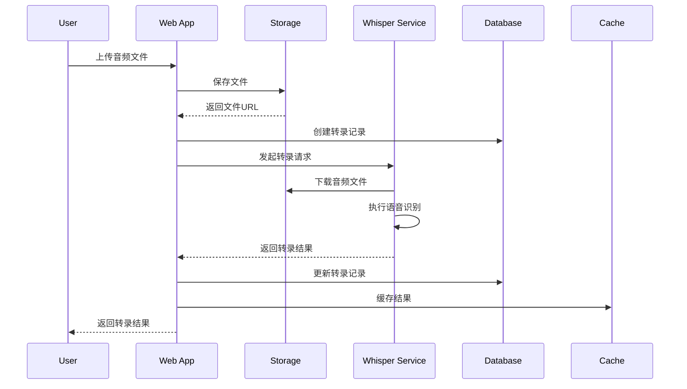
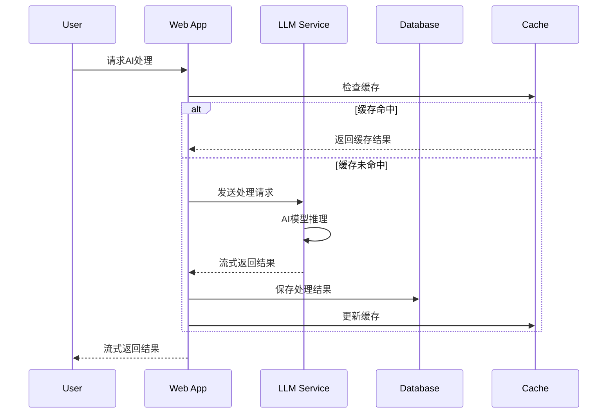
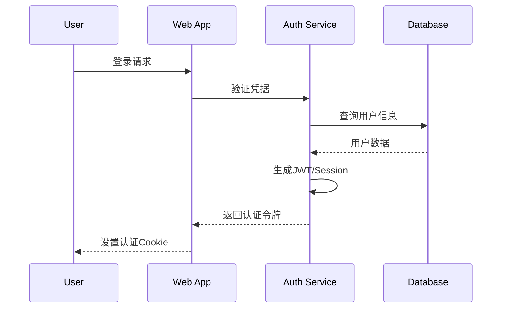

# Whisper App 架构设计文档

本文档详细介绍了 Whisper App 的系统架构、设计理念和技术选型，帮助开发者和运维人员深入理解系统结构。

## 📋 目录

1. [系统概览](#系统概览)
2. [架构设计原则](#架构设计原则)
3. [系统架构图](#系统架构图)
4. [技术栈选型](#技术栈选型)
5. [核心组件](#核心组件)
6. [数据流设计](#数据流设计)
7. [服务间通信](#服务间通信)
8. [安全架构](#安全架构)
9. [性能设计](#性能设计)
10. [扩展性设计](#扩展性设计)

## 🔍 系统概览

Whisper App 是一个完全本地化的语音转录和AI智能处理平台，采用微服务架构设计，支持高并发、高可用的音频处理需求。

### 核心功能模块

- **语音转录模块**: 基于OpenAI Whisper的本地语音识别
- **AI处理模块**: 基于Ollama的本地大语言模型处理
- **文件管理模块**: 支持本地存储和MinIO对象存储
- **用户管理模块**: 基于NextAuth.js的认证授权系统
- **数据管理模块**: PostgreSQL关系型数据库存储
- **缓存模块**: Redis缓存和会话管理

### 设计目标

- **隐私优先**: 所有数据本地处理，不依赖外部云服务
- **高可用性**: 支持服务故障自动恢复和负载均衡
- **高性能**: 优化的音频处理流水线和缓存策略
- **可扩展**: 模块化设计，支持水平和垂直扩展
- **易部署**: 容器化部署，一键启动完整服务栈

## 🏗️ 架构设计原则

### 1. 单一职责原则
每个服务模块专注于单一业务领域，职责清晰分离：
- Web应用层：用户界面和API网关
- 业务逻辑层：转录处理和AI推理
- 数据存储层：数据库和对象存储
- 基础设施层：缓存、消息队列、监控

### 2. 松耦合设计
服务间通过标准化接口通信，减少相互依赴：
- HTTP/REST API用于跨服务通信
- tRPC提供类型安全的内部通信
- 事件驱动架构处理异步任务
- 配置外部化管理

### 3. 高内聚设计
相关功能集中在同一服务模块内：
- 转录相关功能集中在Whisper服务
- 用户管理功能集中在Auth服务
- 文件操作功能集中在Storage服务

### 4. 可观测性
系统具备完整的监控和日志体系：
- 结构化日志记录
- 性能指标收集
- 健康检查端点
- 分布式追踪支持

## 🏛️ 系统架构图

```
┌─────────────────────────────────────────────────────────────────┐
│                        Client Layer                              │
├─────────────────────────────────────────────────────────────────┤
│  Web Browser    │  Mobile App    │  API Clients    │  CLI Tools │
└─────────────────┴────────────────┴─────────────────────────────────┘
                                  │
                                  ▼
┌─────────────────────────────────────────────────────────────────┐
│                     Application Layer                            │
├─────────────────────────────────────────────────────────────────┤
│                     Next.js Application                          │
│  ┌───────────────┐  ┌─────────────┐  ┌─────────────────────────┐│
│  │   Pages/UI    │  │ API Routes  │  │      tRPC Routers       ││
│  │               │  │             │  │                         ││
│  │ - Dashboard   │  │ - Auth      │  │ - whisper.ts            ││
│  │ - Upload      │  │ - Files     │  │ - limit.ts              ││
│  │ - History     │  │ - Transform │  │ - user.ts               ││
│  └───────────────┘  └─────────────┘  └─────────────────────────┘│
└─────────────────────────────────────────────────────────────────┘
                                  │
                                  ▼
┌─────────────────────────────────────────────────────────────────┐
│                      Service Layer                               │
├─────────────────────────────────────────────────────────────────┤
│  ┌─────────────────┐  ┌─────────────────┐  ┌─────────────────┐  │
│  │   Auth Service  │  │ Whisper Service │  │   LLM Service   │  │
│  │                 │  │                 │  │                 │  │
│  │ - NextAuth.js   │  │ - Local Whisper │  │ - Ollama        │  │
│  │ - Session Mgmt  │  │ - Transcription │  │ - Text Process  │  │
│  │ - User Profile  │  │ - Language Det  │  │ - Model Mgmt    │  │
│  └─────────────────┘  └─────────────────┘  └─────────────────┘  │
│                                                                  │
│  ┌─────────────────┐  ┌─────────────────┐  ┌─────────────────┐  │
│  │ Storage Service │  │  Cache Service  │  │ Monitor Service │  │
│  │                 │  │                 │  │                 │  │
│  │ - MinIO         │  │ - Redis         │  │ - Health Check  │  │
│  │ - File Upload   │  │ - Rate Limiting │  │ - Metrics       │  │
│  │ - File Cleanup  │  │ - Session Store │  │ - Alerts        │  │
│  └─────────────────┘  └─────────────────┘  └─────────────────┘  │
└─────────────────────────────────────────────────────────────────┘
                                  │
                                  ▼
┌─────────────────────────────────────────────────────────────────┐
│                       Data Layer                                 │
├─────────────────────────────────────────────────────────────────┤
│  ┌─────────────────┐  ┌─────────────────┐  ┌─────────────────┐  │
│  │   PostgreSQL    │  │      Redis      │  │      MinIO      │  │
│  │                 │  │                 │  │                 │  │
│  │ - User Data     │  │ - Sessions      │  │ - Audio Files   │  │
│  │ - Transcripts   │  │ - Rate Limits   │  │ - Temp Files    │  │
│  │ - Metadata      │  │ - Cache Data    │  │ - Backups       │  │
│  └─────────────────┘  └─────────────────┘  └─────────────────┘  │
└─────────────────────────────────────────────────────────────────┘
                                  │
                                  ▼
┌─────────────────────────────────────────────────────────────────┐
│                  Infrastructure Layer                            │
├─────────────────────────────────────────────────────────────────┤
│          Docker Containers + Docker Compose                      │
│                                                                  │
│  Network: whisper_network (Bridge Network)                       │
│  Volumes: postgres_data, redis_data, minio_data, ollama_data     │
│  Health Checks: All services with custom health endpoints        │
└─────────────────────────────────────────────────────────────────┘
```

## 🛠️ 技术栈选型

### 前端技术栈

| 技术 | 版本 | 用途 | 选择理由 |
|------|------|------|----------|
| **Next.js** | 15.2.4 | 全栈框架 | 支持SSR/SSG，优秀的开发体验 |
| **React** | 19.0.0 | UI框架 | 生态丰富，组件化开发 |
| **TypeScript** | 5.x | 类型系统 | 提供类型安全和更好的开发体验 |
| **Tailwind CSS** | 4.x | 样式框架 | 原子化CSS，快速开发 |
| **tRPC** | 11.4.3 | API层 | 端到端类型安全 |
| **React Query** | 5.81.5 | 状态管理 | 服务端状态管理和缓存 |

### 后端技术栈

| 技术 | 版本 | 用途 | 选择理由 |
|------|------|------|----------|
| **Node.js** | 18+ | 运行时 | 统一前后端开发语言 |
| **Prisma** | 6.11.1 | ORM | 类型安全的数据库操作 |
| **NextAuth.js** | 6.28.0 | 认证 | 完整的认证解决方案 |
| **Zod** | 3.25.74 | 验证 | 运行时类型验证 |

### AI和音频处理

| 技术 | 版本 | 用途 | 选择理由 |
|------|------|------|----------|
| **Ollama** | latest | LLM服务 | 本地部署，支持多种模型 |
| **Whisper** | latest | 语音识别 | OpenAI开源，高质量转录 |
| **FFmpeg** | 系统安装 | 音频处理 | 强大的音频/视频处理工具 |

### 数据存储

| 技术 | 版本 | 用途 | 选择理由 |
|------|------|------|----------|
| **PostgreSQL** | 16-alpine | 主数据库 | 关系型数据库，ACID支持 |
| **Redis** | 7-alpine | 缓存 | 高性能内存数据库 |
| **MinIO** | latest | 对象存储 | S3兼容的本地对象存储 |

### 容器化和部署

| 技术 | 版本 | 用途 | 选择理由 |
|------|------|------|----------|
| **Docker** | 20.10+ | 容器化 | 标准化部署环境 |
| **Docker Compose** | 2.0+ | 服务编排 | 简化多服务管理 |

## 🔧 核心组件

### 1. Web应用层 (Next.js App)

**职责**:
- 用户界面渲染和交互
- API路由处理
- 用户认证和会话管理
- 文件上传和下载
- 实时数据更新

**关键文件**:
```
app/
├── api/                    # API路由
│   ├── auth/              # 认证相关API
│   ├── files/             # 文件管理API
│   ├── transform/         # AI处理API
│   └── trpc/              # tRPC路由
├── whispers/              # 转录页面
└── layout.tsx             # 应用布局
```

**特性**:
- 服务端渲染 (SSR) 优化SEO和首屏加载
- API路由提供RESTful接口
- 中间件处理认证和授权
- 响应式设计支持多设备

### 2. 数据访问层 (Prisma ORM)

**职责**:
- 数据库模式定义和迁移
- 类型安全的数据库操作
- 查询优化和关系处理
- 数据验证和约束

**核心模型**:
```typescript
// Whisper转录记录
model Whisper {
  id                String       @id @default(uuid())
  title             String
  userId            String
  user              User         @relation(fields: [userId], references: [id])
  createdAt         DateTime     @default(now())
  fullTranscription String
  audioTracks       AudioTrack[]
  transformations   Transformation[]
}

// AI处理结果
model Transformation {
  id           String   @id @default(uuid())
  whisperId    String
  whisper      Whisper? @relation(fields: [whisperId], references: [id])
  isGenerating Boolean  @default(true)
  typeName     String
  text         String
  createdAt    DateTime @default(now())
  updatedAt    DateTime @updatedAt
}
```

### 3. AI服务层 (Ollama + Whisper)

**Whisper服务**:
```typescript
// 本地Whisper服务封装
export class LocalWhisperService {
  async transcribe(audioUrl: string, options?: TranscribeOptions) {
    // 下载音频文件
    // 调用whisper模型进行转录
    // 返回转录结果和元数据
  }
}
```

**LLM服务**:
```typescript
// 本地LLM服务封装
export class LocalLLMService {
  async generate(prompt: string, options?: GenerateOptions) {
    // 构建请求参数
    // 调用Ollama API
    // 处理流式响应
  }
}
```

### 4. 存储服务层

**文件存储架构**:
```
Storage Strategy
├── Local Storage          # 开发环境
│   └── public/uploads/
└── MinIO Storage         # 生产环境
    ├── audio-files/      # 永久音频文件
    └── temp-files/       # 临时处理文件
```

**存储服务接口**:
```typescript
interface StorageService {
  upload(file: File, options?: UploadOptions): Promise<UploadResult>;
  download(key: string): Promise<Buffer>;
  delete(key: string): Promise<void>;
  list(prefix?: string): Promise<FileInfo[]>;
}
```

### 5. 缓存和会话层 (Redis)

**缓存策略**:
- **会话存储**: NextAuth.js会话数据
- **速率限制**: API调用频率控制
- **结果缓存**: 转录和AI处理结果缓存
- **临时数据**: 上传进度和处理状态

**Redis数据结构**:
```
session:${sessionId}     # 用户会话数据
rate_limit:${userId}     # 用户速率限制
transcription:${id}      # 转录结果缓存
processing:${taskId}     # 处理状态追踪
```

## 📊 数据流设计

### 音频转录流程



### AI处理流程



## 🔗 服务间通信

### 1. 同步通信

**HTTP REST API**:
- 文件上传和下载
- 健康检查
- 管理操作

**tRPC**:
- 类型安全的内部通信
- 实时数据查询
- 状态同步

### 2. 异步通信

**事件驱动**:
- 文件处理完成事件
- 用户操作审计事件
- 系统监控事件

**消息队列** (未来扩展):
- 批量处理任务
- 长时间运行任务
- 跨服务事件传播

### 3. 通信模式

```typescript
// API网关模式
export class APIGateway {
  private services = {
    whisper: new WhisperService(),
    llm: new LLMService(),
    storage: new StorageService(),
  };

  async handleRequest(request: APIRequest) {
    // 路由到相应服务
    // 处理认证和授权
    // 返回统一格式响应
  }
}

// 服务发现模式
export class ServiceRegistry {
  private services: Map<string, ServiceInfo> = new Map();

  register(name: string, info: ServiceInfo) {
    this.services.set(name, info);
  }

  discover(name: string): ServiceInfo | null {
    return this.services.get(name) || null;
  }
}
```

## 🔒 安全架构

### 1. 认证和授权

**认证流程**:


**授权机制**:
- 基于会话的授权控制
- 资源级别权限检查
- API速率限制
- 用户数据隔离

### 2. 数据安全

**数据加密**:
- 传输加密：HTTPS/TLS
- 存储加密：数据库字段加密
- 会话加密：安全Cookie配置

**数据隔离**:
- 用户数据严格隔离
- 多租户支持
- 审计日志记录

### 3. 系统安全

**容器安全**:
- 最小权限原则
- 安全镜像基准
- 网络隔离
- 资源限制

**API安全**:
- 输入验证和清理
- SQL注入防护
- XSS攻击防护
- CSRF保护

## ⚡ 性能设计

### 1. 缓存策略

**多级缓存架构**:
```
Browser Cache (客户端)
    ↓
CDN Cache (未来扩展)
    ↓
Application Cache (Redis)
    ↓
Database Cache (PostgreSQL Query Cache)
```

**缓存类型**:
- **静态资源缓存**: CSS, JS, 图片
- **API响应缓存**: 转录结果，用户信息
- **会话缓存**: 用户会话状态
- **计算结果缓存**: AI处理结果

### 2. 数据库优化

**查询优化**:
```sql
-- 索引优化
CREATE INDEX CONCURRENTLY idx_whisper_user_created 
ON "Whisper" (userId, createdAt DESC);

CREATE INDEX CONCURRENTLY idx_transformation_whisper 
ON "Transformation" (whisperId);

-- 分区表 (未来扩展)
CREATE TABLE whisper_2024 PARTITION OF "Whisper"
FOR VALUES FROM ('2024-01-01') TO ('2025-01-01');
```

**连接池管理**:
```typescript
// Prisma连接池配置
datasource db {
  provider = "postgresql"
  url      = env("DATABASE_URL")
  // 连接池配置
  connection_limit = 20
  pool_timeout = 20
}
```

### 3. 异步处理

**任务队列设计**:
```typescript
interface TaskQueue {
  enqueue<T>(task: Task<T>): Promise<TaskId>;
  dequeue(): Promise<Task | null>;
  status(taskId: TaskId): Promise<TaskStatus>;
}

// 音频处理任务
class AudioProcessingTask implements Task {
  async execute() {
    // 异步处理音频转录
    // 更新进度状态
    // 缓存处理结果
  }
}
```

## 🚀 扩展性设计

### 1. 水平扩展

**无状态设计**:
- Web应用层无状态
- 会话存储外部化
- 负载均衡支持

**微服务拆分** (未来):
```
Monolith (当前)
    ↓
Gateway + Auth Service + Whisper Service + Storage Service
    ↓
细粒度微服务架构
```

### 2. 垂直扩展

**资源配置**:
```yaml
# Docker Compose资源限制
services:
  app:
    deploy:
      resources:
        limits:
          cpus: '2.0'
          memory: 4G
        reservations:
          cpus: '1.0'
          memory: 2G

  ollama:
    deploy:
      resources:
        limits:
          memory: 8G
        reservations:
          devices:
            - capabilities: [gpu]
```

### 3. 功能扩展

**插件架构** (规划):
```typescript
interface Plugin {
  name: string;
  version: string;
  install(): Promise<void>;
  uninstall(): Promise<void>;
  execute(context: PluginContext): Promise<PluginResult>;
}

// 自定义转录处理插件
class CustomTranscriptionPlugin implements Plugin {
  async execute(context: { audioUrl: string }) {
    // 自定义转录逻辑
  }
}
```

## 📈 监控和可观测性

### 1. 健康检查

```typescript
// 综合健康检查
export class HealthChecker {
  async checkDatabase() {
    // 数据库连接检查
  }

  async checkRedis() {
    // Redis连接检查
  }

  async checkStorage() {
    // 存储服务检查
  }

  async checkAI() {
    // AI服务检查
  }
}
```

### 2. 指标收集

**关键指标**:
- 响应时间和吞吐量
- 错误率和可用性
- 资源使用率
- 业务指标 (转录时长、用户活跃度)

### 3. 日志系统

**结构化日志**:
```typescript
import { logger } from './utils/logger';

logger.info('Transcription started', {
  userId: 'user_123',
  whisperId: 'whisper_456',
  audioUrl: 'audio.mp3',
  timestamp: new Date().toISOString()
});
```

## 🔄 未来架构演进

### 短期优化 (3-6个月)
- [ ] 引入消息队列处理异步任务
- [ ] 实现更细粒度的缓存策略
- [ ] 添加更多AI模型支持
- [ ] 优化数据库查询性能

### 中期扩展 (6-12个月)
- [ ] 微服务架构重构
- [ ] 容器编排系统 (Kubernetes)
- [ ] 监控和告警系统
- [ ] 插件系统架构

### 长期规划 (12个月以上)
- [ ] 多租户SaaS架构
- [ ] 边缘计算支持
- [ ] 联邦学习架构
- [ ] 云原生部署支持

---

**这份架构文档为系统的设计决策和技术选型提供了全面的说明。** 🏗️

如需了解具体实现细节，请查看 [代码结构说明](../developer/CODE_STRUCTURE.md) 或 [数据库模型文档](./DATABASE_SCHEMA.md)。