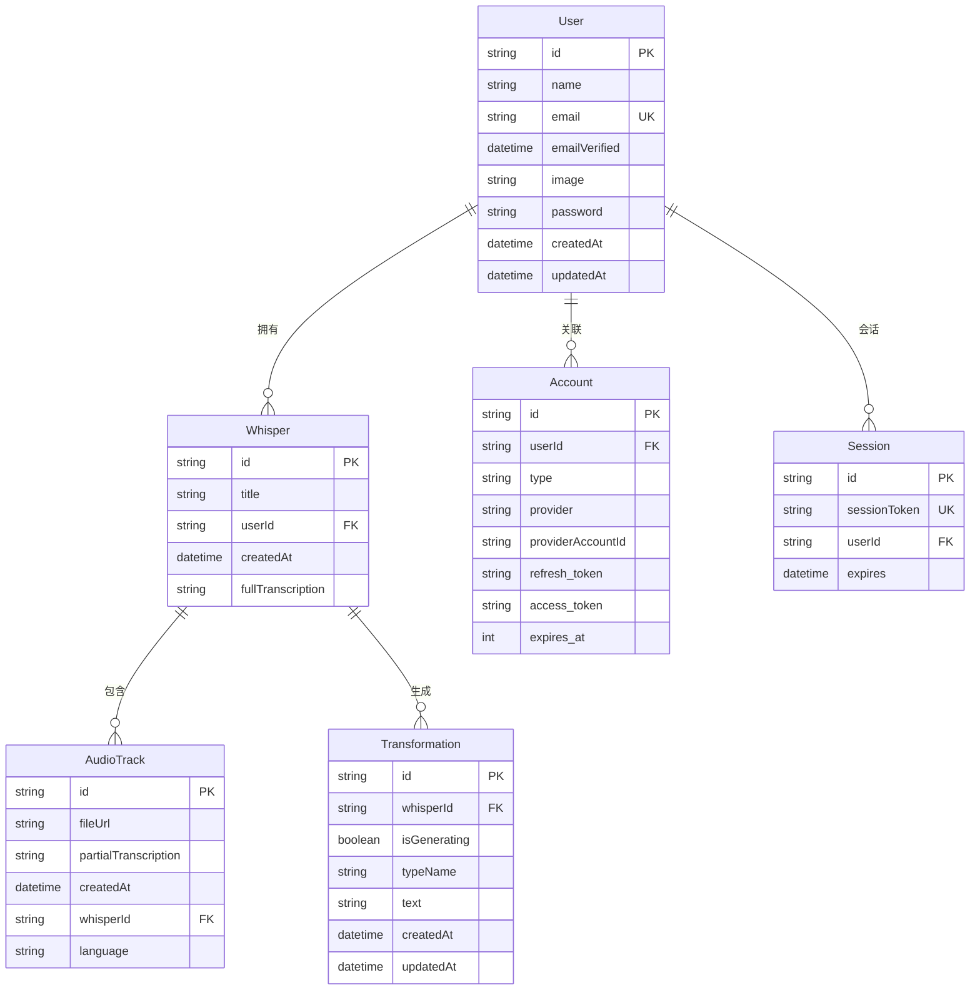

# Whisper App 数据库模型文档

本文档详细描述了 Whisper App的数据库设计，包括表结构、关系映射、索引优化和数据迁移策略。

## 📋 目录

1. [数据库概览](#数据库概览)
2. [核心数据模型](#核心数据模型)
3. [用户认证模型](#用户认证模型)
4. [数据关系图](#数据关系图)
5. [索引策略](#索引策略)
6. [数据约束](#数据约束)
7. [查询优化](#查询优化)
8. [数据迁移](#数据迁移)
9. [备份策略](#备份策略)

## 🗄️ 数据库概览

### 技术选型
- **数据库**: PostgreSQL 16
- **ORM**: Prisma 6.11.1
- **迁移工具**: Prisma Migrate
- **连接池**: Prisma内置连接池
- **备份**: pg_dump + 自定义脚本

### 数据库配置
```sql
-- 性能优化配置
shared_buffers = 256MB
effective_cache_size = 1GB
maintenance_work_mem = 64MB
wal_buffers = 16MB

-- 连接配置
max_connections = 100
```

### 命名约定
- **表名**: PascalCase (如 `User`, `Whisper`)
- **字段名**: camelCase (如 `userId`, `createdAt`)
- **索引名**: `idx_表名_字段名` (如 `idx_whisper_user_created`)
- **外键名**: `fk_表名_关联表名` (如 `fk_whisper_user`)

## 📊 核心数据模型

### 1. Whisper (转录记录)

转录记录是系统的核心实体，存储音频转录的完整信息。

```sql
CREATE TABLE "Whisper" (
    id                TEXT NOT NULL,
    title             TEXT NOT NULL,
    userId            TEXT NOT NULL,
    createdAt         TIMESTAMP(3) NOT NULL DEFAULT CURRENT_TIMESTAMP,
    fullTranscription TEXT NOT NULL,
    
    CONSTRAINT "Whisper_pkey" PRIMARY KEY (id),
    CONSTRAINT "Whisper_userId_fkey" FOREIGN KEY (userId) REFERENCES "User"(id) ON DELETE RESTRICT ON UPDATE CASCADE
);
```

**字段说明**:
| 字段 | 类型 | 约束 | 描述 |
|------|------|------|------|
| `id` | TEXT | PRIMARY KEY | UUID格式的唯一标识符 |
| `title` | TEXT | NOT NULL | 转录记录标题 |
| `userId` | TEXT | NOT NULL, FK | 关联用户ID |
| `createdAt` | TIMESTAMP(3) | NOT NULL, DEFAULT | 创建时间戳 |
| `fullTranscription` | TEXT | NOT NULL | 完整转录文本 |

**Prisma模型定义**:
```typescript
model Whisper {
  id                String       @id @default(uuid())
  title             String
  userId            String
  user              User         @relation(fields: [userId], references: [id])
  createdAt         DateTime     @default(now())
  fullTranscription String
  audioTracks       AudioTrack[]
  transformations   Transformation[]
}
```

### 2. AudioTrack (音频轨道)

存储音频文件信息和部分转录结果。

```sql
CREATE TABLE "AudioTrack" (
    id                   TEXT NOT NULL,
    fileUrl              TEXT NOT NULL,
    partialTranscription TEXT NOT NULL,
    createdAt            TIMESTAMP(3) NOT NULL DEFAULT CURRENT_TIMESTAMP,
    whisperId            TEXT NOT NULL,
    language             TEXT,
    
    CONSTRAINT "AudioTrack_pkey" PRIMARY KEY (id),
    CONSTRAINT "AudioTrack_whisperId_fkey" FOREIGN KEY (whisperId) REFERENCES "Whisper"(id) ON DELETE RESTRICT ON UPDATE CASCADE
);
```

**字段说明**:
| 字段 | 类型 | 约束 | 描述 |
|------|------|------|------|
| `id` | TEXT | PRIMARY KEY | UUID格式的唯一标识符 |
| `fileUrl` | TEXT | NOT NULL | 音频文件URL |
| `partialTranscription` | TEXT | NOT NULL | 部分转录文本 |
| `createdAt` | TIMESTAMP(3) | NOT NULL, DEFAULT | 创建时间戳 |
| `whisperId` | TEXT | NOT NULL, FK | 关联转录记录ID |
| `language` | TEXT | NULLABLE | 检测到的语言代码 |

### 3. Transformation (AI处理结果)

存储AI处理的结果，如摘要、翻译等。

```sql
CREATE TABLE "Transformation" (
    id           TEXT NOT NULL,
    whisperId    TEXT NOT NULL,
    isGenerating BOOLEAN NOT NULL DEFAULT true,
    typeName     TEXT NOT NULL,
    text         TEXT NOT NULL,
    createdAt    TIMESTAMP(3) NOT NULL DEFAULT CURRENT_TIMESTAMP,
    updatedAt    TIMESTAMP(3) NOT NULL,
    
    CONSTRAINT "Transformation_pkey" PRIMARY KEY (id),
    CONSTRAINT "Transformation_whisperId_fkey" FOREIGN KEY (whisperId) REFERENCES "Whisper"(id) ON DELETE RESTRICT ON UPDATE CASCADE
);
```

**字段说明**:
| 字段 | 类型 | 约束 | 描述 |
|------|------|------|------|
| `id` | TEXT | PRIMARY KEY | UUID格式的唯一标识符 |
| `whisperId` | TEXT | NOT NULL, FK | 关联转录记录ID |
| `isGenerating` | BOOLEAN | NOT NULL, DEFAULT | 是否正在生成中 |
| `typeName` | TEXT | NOT NULL | 处理类型 (summary, email, etc.) |
| `text` | TEXT | NOT NULL | 处理结果文本 |
| `createdAt` | TIMESTAMP(3) | NOT NULL, DEFAULT | 创建时间戳 |
| `updatedAt` | TIMESTAMP(3) | NOT NULL | 更新时间戳 |

**处理类型枚举**:
```typescript
enum TransformationType {
  SUMMARY = 'summary',
  EMAIL = 'email',
  LIST = 'list',
  NOTES = 'notes',
  CUSTOM = 'custom'
}
```

## 👤 用户认证模型

基于NextAuth.js的认证模型，支持多种登录方式。

### 1. User (用户)

```sql
CREATE TABLE "User" (
    id            TEXT NOT NULL,
    name          TEXT,
    email         TEXT NOT NULL,
    emailVerified TIMESTAMP(3),
    image         TEXT,
    password      TEXT,
    createdAt     TIMESTAMP(3) NOT NULL DEFAULT CURRENT_TIMESTAMP,
    updatedAt     TIMESTAMP(3) NOT NULL,
    
    CONSTRAINT "User_pkey" PRIMARY KEY (id),
    CONSTRAINT "User_email_key" UNIQUE (email)
);
```

**字段说明**:
| 字段 | 类型 | 约束 | 描述 |
|------|------|------|------|
| `id` | TEXT | PRIMARY KEY | CUID格式的唯一标识符 |
| `name` | TEXT | NULLABLE | 用户显示名称 |
| `email` | TEXT | NOT NULL, UNIQUE | 用户邮箱地址 |
| `emailVerified` | TIMESTAMP(3) | NULLABLE | 邮箱验证时间 |
| `image` | TEXT | NULLABLE | 用户头像URL |
| `password` | TEXT | NULLABLE | 密码哈希 (credentials认证) |
| `createdAt` | TIMESTAMP(3) | NOT NULL, DEFAULT | 创建时间戳 |
| `updatedAt` | TIMESTAMP(3) | NOT NULL | 更新时间戳 |

### 2. Account (外部账户)

存储OAuth等外部认证提供商的账户信息。

```sql
CREATE TABLE "Account" (
    id                TEXT NOT NULL,
    userId            TEXT NOT NULL,
    type              TEXT NOT NULL,
    provider          TEXT NOT NULL,
    providerAccountId TEXT NOT NULL,
    refresh_token     TEXT,
    access_token      TEXT,
    expires_at        INTEGER,
    token_type        TEXT,
    scope             TEXT,
    id_token          TEXT,
    session_state     TEXT,
    
    CONSTRAINT "Account_pkey" PRIMARY KEY (id),
    CONSTRAINT "Account_userId_fkey" FOREIGN KEY (userId) REFERENCES "User"(id) ON DELETE CASCADE ON UPDATE CASCADE,
    CONSTRAINT "Account_provider_providerAccountId_key" UNIQUE (provider, providerAccountId)
);
```

### 3. Session (用户会话)

存储用户登录会话信息。

```sql
CREATE TABLE "Session" (
    id           TEXT NOT NULL,
    sessionToken TEXT NOT NULL,
    userId       TEXT NOT NULL,
    expires      TIMESTAMP(3) NOT NULL,
    
    CONSTRAINT "Session_pkey" PRIMARY KEY (id),
    CONSTRAINT "Session_sessionToken_key" UNIQUE (sessionToken),
    CONSTRAINT "Session_userId_fkey" FOREIGN KEY (userId) REFERENCES "User"(id) ON DELETE CASCADE ON UPDATE CASCADE
);
```

### 4. VerificationToken (验证令牌)

用于邮箱验证等场景的临时令牌。

```sql
CREATE TABLE "VerificationToken" (
    identifier TEXT NOT NULL,
    token      TEXT NOT NULL,
    expires    TIMESTAMP(3) NOT NULL,
    
    CONSTRAINT "VerificationToken_token_key" UNIQUE (token),
    CONSTRAINT "VerificationToken_identifier_token_key" UNIQUE (identifier, token)
);
```

## 🔗 数据关系图



## 📈 索引策略

### 1. 性能关键索引

```sql
-- 用户转录记录查询优化
CREATE INDEX CONCURRENTLY idx_whisper_user_created 
ON "Whisper" (userId, createdAt DESC);

-- 转录的AI处理结果查询
CREATE INDEX CONCURRENTLY idx_transformation_whisper 
ON "Transformation" (whisperId);

-- 音频轨道关联查询
CREATE INDEX CONCURRENTLY idx_audiotrack_whisper 
ON "AudioTrack" (whisperId);

-- 用户会话查询优化
CREATE INDEX CONCURRENTLY idx_session_user 
ON "Session" (userId);

-- 外部账户查询优化
CREATE INDEX CONCURRENTLY idx_account_user 
ON "Account" (userId);
```

### 2. 全文搜索索引

```sql
-- 转录内容全文搜索
CREATE INDEX CONCURRENTLY idx_whisper_transcription_fts 
ON "Whisper" USING gin(to_tsvector('english', fullTranscription));

-- AI处理结果全文搜索
CREATE INDEX CONCURRENTLY idx_transformation_text_fts 
ON "Transformation" USING gin(to_tsvector('english', text));
```

### 3. 复合索引

```sql
-- 用户特定类型的转换结果
CREATE INDEX CONCURRENTLY idx_transformation_user_type 
ON "Transformation" (whisperId, typeName, createdAt DESC);

-- 用户语言统计
CREATE INDEX CONCURRENTLY idx_audiotrack_user_language 
ON "AudioTrack" (whisperId, language);
```

## 🛡️ 数据约束

### 1. 检查约束

```sql
-- 确保邮箱格式正确
ALTER TABLE "User" ADD CONSTRAINT check_email_format 
CHECK (email ~* '^[A-Za-z0-9._%+-]+@[A-Za-z0-9.-]+\.[A-Za-z]{2,}$');

-- 确保转录标题不为空
ALTER TABLE "Whisper" ADD CONSTRAINT check_title_not_empty 
CHECK (LENGTH(TRIM(title)) > 0);

-- 确保转录内容不为空
ALTER TABLE "Whisper" ADD CONSTRAINT check_transcription_not_empty 
CHECK (LENGTH(TRIM(fullTranscription)) > 0);

-- 确保音频URL格式正确
ALTER TABLE "AudioTrack" ADD CONSTRAINT check_file_url_format 
CHECK (fileUrl ~* '^https?://.*\.(mp3|wav|m4a|ogg|flac|aac|wma|webm|mp4)$');
```

### 2. 触发器约束

```sql
-- 自动更新updatedAt字段
CREATE OR REPLACE FUNCTION update_updated_at_column()
RETURNS TRIGGER AS $$
BEGIN
    NEW.updatedAt = CURRENT_TIMESTAMP;
    RETURN NEW;
END;
$$ language 'plpgsql';

CREATE TRIGGER update_user_updated_at 
    BEFORE UPDATE ON "User" 
    FOR EACH ROW 
    EXECUTE FUNCTION update_updated_at_column();

CREATE TRIGGER update_transformation_updated_at 
    BEFORE UPDATE ON "Transformation" 
    FOR EACH ROW 
    EXECUTE FUNCTION update_updated_at_column();
```

### 3. 数据验证函数

```sql
-- 验证语言代码格式
CREATE OR REPLACE FUNCTION is_valid_language_code(lang_code TEXT) 
RETURNS BOOLEAN AS $$
BEGIN
    RETURN lang_code IS NULL OR lang_code ~ '^[a-z]{2,3}(-[A-Z]{2})?$';
END;
$$ LANGUAGE plpgsql;

ALTER TABLE "AudioTrack" ADD CONSTRAINT check_valid_language 
CHECK (is_valid_language_code(language));
```

## 🚀 查询优化

### 1. 常用查询模式

**获取用户的转录记录列表**:
```sql
-- 优化后的查询
SELECT 
    w.id,
    w.title,
    w.createdAt,
    w.fullTranscription,
    COUNT(t.id) as transformation_count
FROM "Whisper" w
LEFT JOIN "Transformation" t ON w.id = t.whisperId
WHERE w.userId = $1
GROUP BY w.id, w.title, w.createdAt, w.fullTranscription
ORDER BY w.createdAt DESC
LIMIT $2 OFFSET $3;

-- 对应的Prisma查询
const whispers = await prisma.whisper.findMany({
  where: { userId },
  include: {
    _count: {
      select: { transformations: true }
    }
  },
  orderBy: { createdAt: 'desc' },
  skip: offset,
  take: limit
});
```

**搜索转录内容**:
```sql
-- 全文搜索查询
SELECT 
    id,
    title,
    createdAt,
    ts_headline('english', fullTranscription, plainto_tsquery($2)) as highlighted_text,
    ts_rank(to_tsvector('english', fullTranscription), plainto_tsquery($2)) as rank
FROM "Whisper"
WHERE 
    userId = $1 
    AND to_tsvector('english', fullTranscription) @@ plainto_tsquery($2)
ORDER BY rank DESC, createdAt DESC;
```

### 2. 查询性能分析

```sql
-- 查看查询执行计划
EXPLAIN (ANALYZE, BUFFERS) 
SELECT * FROM "Whisper" 
WHERE userId = 'user_123' 
ORDER BY createdAt DESC 
LIMIT 10;

-- 查看索引使用情况
SELECT 
    indexname,
    idx_scan,
    idx_tup_read,
    idx_tup_fetch
FROM pg_stat_user_indexes 
WHERE relname = 'Whisper';
```

### 3. 分页优化

```sql
-- 使用cursor-based分页优化大数据集
SELECT * FROM "Whisper"
WHERE userId = $1 AND createdAt < $2
ORDER BY createdAt DESC
LIMIT $3;

-- Prisma实现
const whispers = await prisma.whisper.findMany({
  where: {
    userId,
    createdAt: {
      lt: cursor
    }
  },
  orderBy: { createdAt: 'desc' },
  take: pageSize
});
```

## 🔄 数据迁移

### 1. 版本控制

使用Prisma Migrate管理数据库版本：

```bash
# 创建新迁移
npx prisma migrate dev --name add_language_support

# 应用迁移到生产环境
npx prisma migrate deploy

# 查看迁移状态
npx prisma migrate status
```

### 2. 迁移脚本示例

**添加语言支持字段**:
```sql
-- Migration: 20240101000001_add_language_support
-- 添加语言字段到AudioTrack表
ALTER TABLE "AudioTrack" ADD COLUMN language TEXT;

-- 为现有记录设置默认语言
UPDATE "AudioTrack" SET language = 'auto' WHERE language IS NULL;

-- 添加索引
CREATE INDEX CONCURRENTLY idx_audiotrack_language ON "AudioTrack" (language);
```

**数据类型优化**:
```sql
-- Migration: 20240101000002_optimize_text_storage
-- 将大文本字段移到单独表中 (如果需要)
CREATE TABLE "TranscriptionContent" (
    whisperId TEXT NOT NULL PRIMARY KEY,
    content TEXT NOT NULL,
    FOREIGN KEY (whisperId) REFERENCES "Whisper"(id) ON DELETE CASCADE
);

-- 迁移现有数据
INSERT INTO "TranscriptionContent" (whisperId, content)
SELECT id, fullTranscription FROM "Whisper";

-- 删除原字段
ALTER TABLE "Whisper" DROP COLUMN fullTranscription;
```

### 3. 数据迁移最佳实践

```typescript
// 复杂数据迁移的TypeScript脚本
import { PrismaClient } from '@prisma/client';

const prisma = new PrismaClient();

async function migrateData() {
  // 开始事务
  await prisma.$transaction(async (tx) => {
    // 1. 备份关键数据
    const backupData = await tx.whisper.findMany({
      select: { id: true, fullTranscription: true }
    });

    // 2. 执行数据转换
    for (const record of backupData) {
      await tx.transcriptionContent.create({
        data: {
          whisperId: record.id,
          content: record.fullTranscription
        }
      });
    }

    // 3. 验证数据完整性
    const count1 = await tx.whisper.count();
    const count2 = await tx.transcriptionContent.count();
    
    if (count1 !== count2) {
      throw new Error('Data migration validation failed');
    }
  });
}
```

## 💾 备份策略

### 1. 自动备份脚本

```bash
#!/bin/bash
# scripts/backup-database.sh

BACKUP_DIR="/app/backups"
DATE=$(date +%Y%m%d_%H%M%S)
BACKUP_FILE="whisper_backup_${DATE}.sql"

# 创建备份目录
mkdir -p $BACKUP_DIR

# 执行数据库备份
docker exec whisper_postgres pg_dump \
  -U whisper_user \
  -d whisper_db \
  --no-owner \
  --no-privileges \
  --compress=9 \
  > "$BACKUP_DIR/$BACKUP_FILE"

# 压缩备份文件
gzip "$BACKUP_DIR/$BACKUP_FILE"

# 清理7天前的备份
find $BACKUP_DIR -name "whisper_backup_*.sql.gz" -mtime +7 -delete

echo "Database backup completed: $BACKUP_FILE.gz"
```

### 2. 增量备份

```bash
#!/bin/bash
# 基于WAL的增量备份
docker exec whisper_postgres pg_basebackup \
  -U whisper_user \
  -D /backup/base \
  -Ft -z -P -W

# 配置连续归档
echo "archive_mode = on" >> postgresql.conf
echo "archive_command = 'cp %p /backup/wal/%f'" >> postgresql.conf
```

### 3. 数据恢复

```bash
#!/bin/bash
# scripts/restore-database.sh

BACKUP_FILE=$1

if [ -z "$BACKUP_FILE" ]; then
    echo "Usage: $0 <backup_file>"
    exit 1
fi

# 停止应用连接
docker-compose stop app

# 恢复数据库
gunzip -c "$BACKUP_FILE" | docker exec -i whisper_postgres psql \
  -U whisper_user \
  -d whisper_db

# 重启应用
docker-compose start app

echo "Database restore completed"
```

## 📊 数据库监控

### 1. 性能监控查询

```sql
-- 查看慢查询
SELECT 
    query,
    calls,
    total_time,
    mean_time,
    rows
FROM pg_stat_statements
ORDER BY mean_time DESC
LIMIT 10;

-- 查看表大小
SELECT 
    tablename,
    pg_size_pretty(pg_total_relation_size(schemaname||'.'||tablename)) as size
FROM pg_tables
WHERE schemaname = 'public'
ORDER BY pg_total_relation_size(schemaname||'.'||tablename) DESC;

-- 查看索引使用情况
SELECT 
    indexname,
    idx_scan,
    idx_tup_read
FROM pg_stat_user_indexes
ORDER BY idx_scan DESC;
```

### 2. 连接监控

```sql
-- 查看当前连接
SELECT 
    pid,
    usename,
    application_name,
    client_addr,
    state,
    query_start,
    query
FROM pg_stat_activity
WHERE state = 'active';

-- 查看锁等待
SELECT 
    pid,
    usename,
    query,
    wait_event_type,
    wait_event
FROM pg_stat_activity
WHERE wait_event IS NOT NULL;
```

## 🔮 未来数据库优化

### 1. 分区策略 (计划)

```sql
-- 按时间分区Whisper表
CREATE TABLE whisper_2024 PARTITION OF "Whisper"
FOR VALUES FROM ('2024-01-01') TO ('2025-01-01');

CREATE TABLE whisper_2025 PARTITION OF "Whisper"
FOR VALUES FROM ('2025-01-01') TO ('2026-01-01');
```

### 2. 读写分离 (计划)

```typescript
// 主从数据库配置
const writeDB = new PrismaClient({
  datasources: {
    db: { url: process.env.DATABASE_WRITE_URL }
  }
});

const readDB = new PrismaClient({
  datasources: {
    db: { url: process.env.DATABASE_READ_URL }
  }
});
```

### 3. 数据归档策略 (计划)

```sql
-- 将超过1年的数据移至归档表
CREATE TABLE "WhisperArchive" (LIKE "Whisper" INCLUDING ALL);

-- 自动归档过程
CREATE OR REPLACE FUNCTION archive_old_whispers()
RETURNS void AS $$
BEGIN
    -- 移动数据到归档表
    INSERT INTO "WhisperArchive"
    SELECT * FROM "Whisper"
    WHERE createdAt < NOW() - INTERVAL '1 year';
    
    -- 删除原表中的旧数据
    DELETE FROM "Whisper"
    WHERE createdAt < NOW() - INTERVAL '1 year';
END;
$$ LANGUAGE plpgsql;
```

---

**这份数据库文档为系统的数据管理提供了全面的指导。** 🗄️

如需了解具体的查询操作，请查看 [API使用文档](../main/API_REFERENCE.md) 或 [开发者指南](../developer/DEVELOPMENT_SETUP.md)。