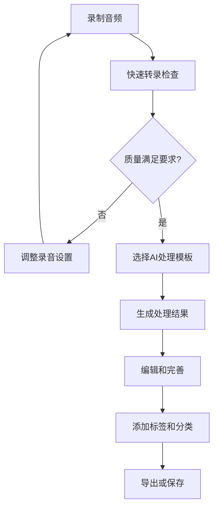

# Whisper App 最佳实践建议

本文档提供了使用 Whisper App 的最佳实践建议，帮助用户获得最佳的使用体验和系统性能。

## 📋 目录

1. [录音和音频准备](#录音和音频准备)
2. [转录质量优化](#转录质量优化)
3. [AI处理优化](#AI处理优化)
4. [数据管理策略](#数据管理策略)
5. [系统性能优化](#系统性能优化)
6. [安全最佳实践](#安全最佳实践)
7. [工作流程建议](#工作流程建议)
8. [故障预防措施](#故障预防措施)

## 🎤 录音和音频准备

### 录音环境优化

#### 理想录音环境
- **安静空间**: 选择没有背景噪音的房间
- **避免回音**: 使用软装饰品减少声音反射
- **稳定环境**: 避免空调、风扇等持续噪音源
- **隔音处理**: 关闭门窗，避免外界干扰

#### 设备选择建议

| 场景 | 推荐设备 | 特点 |
|------|----------|------|
| **专业录音** | 电容麦克风 + 音频接口 | 高保真度，低噪音 |
| **日常使用** | USB麦克风 | 方便易用，质量较好 |
| **移动录音** | 专业录音笔 | 便携，电池续航长 |
| **会议录音** | 全向麦克风 | 多方向拾音 |
| **电话录音** | 耳机麦克风 | 近距离拾音，清晰度高 |

#### 录音技巧

**麦克风位置**:
```
推荐距离: 15-30cm
角度: 45度斜向上
避免: 直接对着嘴部呼吸
```

**录音参数设置**:
- **采样率**: 44.1kHz 或 48kHz
- **位深度**: 16-bit 或 24-bit
- **格式**: WAV（无损）> FLAC > MP3
- **单声道**: 语音录音建议使用单声道

**说话技巧**:
- 保持稳定的语速和音量
- 清晰发音，避免吞字
- 适当停顿，便于后期分段
- 避免频繁的"嗯"、"啊"等填充词

### 音频文件预处理

#### 使用FFmpeg优化音频

```bash
# 标准化音频格式（推荐）
ffmpeg -i input.mp3 -ar 16000 -ac 1 -c:a wav output.wav

# 降噪处理
ffmpeg -i input.wav -af "highpass=f=200, lowpass=f=3000" output_clean.wav

# 音量标准化
ffmpeg -i input.wav -af "volumedetect" -f null /dev/null
ffmpeg -i input.wav -af "volume=0.5" output_normalized.wav

# 去除静音段
ffmpeg -i input.wav -af "silenceremove=start_periods=1:start_silence=0.1:start_threshold=0.02" output_trimmed.wav
```

#### 音频质量检查

```bash
# 检查音频信息
ffprobe -v quiet -print_format json -show_format -show_streams input.wav

# 音频质量分析
ffmpeg -i input.wav -af "astats" -f null -
```

## 🎯 转录质量优化

### 模型选择策略

#### 根据场景选择模型

| 场景 | 推荐模型 | 理由 |
|------|----------|------|
| **快速测试** | tiny | 速度最快，适合验证 |
| **日常使用** | base | 速度和质量平衡 |
| **重要内容** | medium | 更高准确率 |
| **专业转录** | large-v3 | 最高质量 |
| **资源受限** | small | 内存使用较少 |

#### 模型切换命令

```bash
# 下载不同模型
docker exec whisper_ollama ollama pull whisper:tiny
docker exec whisper_ollama ollama pull whisper:base
docker exec whisper_ollama ollama pull whisper:medium

# 在.env.local中设置
WHISPER_MODEL="whisper:medium"
```

### 语言设置优化

#### 语言检测策略

**自动检测适用场景**:
- 不确定音频语言
- 多语言混合内容
- 探索性转录

**手动指定适用场景**:
- 明确知道音频语言
- 追求最高准确率
- 特定方言或口音

#### 常用语言代码

```bash
# 主要语言配置
WHISPER_LANGUAGE="zh"    # 中文
WHISPER_LANGUAGE="en"    # 英语
WHISPER_LANGUAGE="ja"    # 日语
WHISPER_LANGUAGE="ko"    # 韩语
WHISPER_LANGUAGE="auto"  # 自动检测
```

### 转录参数调优

#### 温度参数设置

```bash
# 保守设置（更准确，但可能重复）
WHISPER_TEMPERATURE=0.1

# 平衡设置（推荐）
WHISPER_TEMPERATURE=0.3

# 创造性设置（更多变化，但可能不准确）
WHISPER_TEMPERATURE=0.7
```

#### 高级参数配置

```javascript
// 高质量转录配置
const transcriptionConfig = {
  temperature: 0.1,
  no_speech_threshold: 0.6,
  logprob_threshold: -1.0,
  compression_ratio_threshold: 2.4,
  condition_on_previous_text: true,
  initial_prompt: "这是一段中文商务会议录音。", // 提供上下文
};
```

## 🤖 AI处理优化

### 提示词工程

#### 优秀提示词的特征

1. **具体明确**: 清楚说明期望的输出格式
2. **提供上下文**: 说明内容背景和场景
3. **设定角色**: 为AI设定专业角色
4. **示例引导**: 提供期望输出的示例

#### 提示词模板库

**会议纪要模板**:
```
你是一位专业的会议记录员。请将以下会议录音整理为标准的会议纪要格式：

## 会议基本信息
- 会议主题：[从内容中提取]
- 参与人员：[识别发言人]
- 会议时间：[如果提及]

## 讨论要点
[按重要性排序，每个要点50字以内]

## 决定事项
[明确的决定和结论]

## 行动项目
[具体的后续行动，包括负责人和时间]

会议内容：{transcription}
```

**学术讲座模板**:
```
你是一位学术助理。请将以下讲座内容整理为结构化的学习笔记：

# 讲座标题
[从内容中提取主题]

## 核心概念
[列出3-5个关键概念，每个概念用1-2句话解释]

## 主要观点
[按逻辑顺序整理主要观点]

## 重要细节
[补充说明和具体例子]

## 总结思考
[整体总结和启发]

讲座内容：{transcription}
```

### AI模型选择策略

#### 根据任务选择模型

| 任务类型 | 推荐模型 | 特点 |
|----------|----------|------|
| **中文处理** | qwen2:7b | 中文优化，理解力强 |
| **通用文本** | llama3.1:8b | 平衡性能，广泛适用 |
| **代码相关** | codellama:7b | 代码理解和生成 |
| **快速处理** | phi3:mini | 轻量快速 |
| **创作写作** | mixtral:8x7b | 创造性强 |

#### 模型性能对比测试

```bash
# 测试不同模型的处理速度
time docker exec whisper_ollama ollama run qwen2:7b "总结这段文字"
time docker exec whisper_ollama ollama run llama3.1:8b "总结这段文字"
```

### 处理参数优化

#### 针对不同内容调整参数

```javascript
// 创意写作（更多创造性）
const creativeConfig = {
  temperature: 0.8,
  top_p: 0.9,
  max_tokens: 1500
};

// 事实性总结（更准确）
const factualConfig = {
  temperature: 0.2,
  top_p: 0.8,
  max_tokens: 800
};

// 代码分析（精确性）
const codeConfig = {
  temperature: 0.1,
  top_p: 0.95,
  max_tokens: 2000
};
```

## 💾 数据管理策略

### 文件命名规范

#### 推荐命名格式

```
格式: YYYY-MM-DD_主题_类型.扩展名

示例:
2024-03-15_产品会议_讨论.wav
2024-03-15_用户访谈_张三.mp3
2024-03-15_培训课程_AI技术.flac
2024-03-15_电话录音_客户反馈.m4a
```

#### 标签和分类系统

```javascript
// 建议的标签分类体系
const tagCategories = {
  类型: ['会议', '访谈', '讲座', '培训', '电话'],
  主题: ['产品', '技术', '市场', '客服', '培训'],
  重要性: ['高', '中', '低'],
  状态: ['待处理', '进行中', '已完成'],
  项目: ['项目A', '项目B', '日常运营']
};
```

### 存储空间管理

#### 定期清理策略

```bash
#!/bin/bash
# 自动清理脚本

# 清理30天前的临时文件
find /app/public/uploads/temp -type f -mtime +30 -delete

# 清理90天前的转录记录（保留重要标记的）
# 在应用中实现软删除逻辑

# 压缩6个月前的音频文件
find /app/public/uploads -name "*.wav" -mtime +180 -exec gzip {} \;
```

#### 存储使用监控

```bash
# 检查存储使用情况
df -h /opt/whisper/data
du -sh /opt/whisper/data/*

# 设置告警阈值
if [ $(df /opt/whisper/data | tail -1 | awk '{print $5}' | sed 's/%//') -gt 85 ]; then
    echo "警告：存储使用率超过85%"
fi
```

### 备份策略

#### 3-2-1备份原则

- **3份副本**: 原始数据 + 2份备份
- **2种媒介**: 本地备份 + 云端备份
- **1份异地**: 至少一份备份在不同地点

#### 自动备份配置

```bash
#!/bin/bash
# 每日备份脚本
BACKUP_DIR="/backup/whisper/$(date +%Y%m%d)"

# 创建备份目录
mkdir -p "$BACKUP_DIR"

# 备份数据库
docker exec whisper_postgres pg_dump -U whisper_user whisper_db > "$BACKUP_DIR/database.sql"

# 备份重要文件
rsync -av /opt/whisper/data/uploads/ "$BACKUP_DIR/uploads/"

# 压缩备份
tar -czf "$BACKUP_DIR.tar.gz" "$BACKUP_DIR"
rm -rf "$BACKUP_DIR"

# 清理7天前的备份
find /backup/whisper -name "*.tar.gz" -mtime +7 -delete
```

## ⚡ 系统性能优化

### 硬件配置建议

#### CPU配置

```bash
# 针对不同负载的CPU配置
echo "轻度使用（个人）: 4核心"
echo "中度使用（小团队）: 8核心"
echo "重度使用（企业）: 16核心+"

# 开启CPU性能模式
echo performance | sudo tee /sys/devices/system/cpu/cpu*/cpufreq/scaling_governor
```

#### 内存配置

```yaml
# Docker内存限制配置
services:
  app:
    deploy:
      resources:
        limits:
          memory: 4G
        reservations:
          memory: 2G
  
  ollama:
    deploy:
      resources:
        limits:
          memory: 16G  # 根据模型大小调整
        reservations:
          memory: 8G
```

#### 存储优化

```bash
# SSD优化配置
echo deadline | sudo tee /sys/block/sda/queue/scheduler
echo 1 | sudo tee /sys/block/sda/queue/nomerges

# 挂载参数优化
# /etc/fstab
/dev/sda1 /opt/whisper/data ext4 defaults,noatime,discard 0 2
```

### 网络优化

#### TCP参数调优

```bash
# /etc/sysctl.conf
net.core.somaxconn = 65535
net.core.netdev_max_backlog = 5000
net.ipv4.tcp_max_syn_backlog = 65535
net.ipv4.tcp_keepalive_time = 600
net.ipv4.tcp_keepalive_intvl = 60
net.ipv4.tcp_keepalive_probes = 20

# 应用配置
sudo sysctl -p
```

#### 反向代理配置

```nginx
# nginx.conf 优化配置
upstream whisper_app {
    server localhost:3000;
    keepalive 32;
}

server {
    listen 443 ssl http2;
    server_name your-domain.com;
    
    # 启用gzip压缩
    gzip on;
    gzip_vary on;
    gzip_types text/plain text/css application/json application/javascript text/xml application/xml;
    
    # 客户端缓存
    location ~* \.(js|css|png|jpg|jpeg|gif|ico|svg)$ {
        expires 1y;
        add_header Cache-Control "public, immutable";
    }
    
    location / {
        proxy_pass http://whisper_app;
        proxy_http_version 1.1;
        proxy_set_header Upgrade $http_upgrade;
        proxy_set_header Connection 'upgrade';
        proxy_set_header Host $host;
        proxy_set_header X-Real-IP $remote_addr;
        proxy_cache_bypass $http_upgrade;
        
        # 增加超时时间
        proxy_read_timeout 300s;
        proxy_connect_timeout 75s;
    }
}
```

### 缓存优化

#### Redis缓存策略

```bash
# Redis配置优化
# redis.conf
maxmemory 2gb
maxmemory-policy allkeys-lru
tcp-keepalive 300
timeout 0

# 持久化设置
save 900 1
save 300 10
save 60 10000
```

#### 应用级缓存

```javascript
// 缓存层次结构
const cacheStrategy = {
  // L1: 内存缓存（最快）
  memory: {
    ttl: 300, // 5分钟
    maxSize: 100
  },
  
  // L2: Redis缓存（快）
  redis: {
    ttl: 3600, // 1小时
    compress: true
  },
  
  // L3: 数据库（慢）
  database: {
    indexes: ['user_id', 'created_at'],
    queryCache: true
  }
};
```

## 🔒 安全最佳实践

### 密码和密钥管理

#### 强密码策略

```bash
# 生成强密码
openssl rand -base64 32  # 32字符随机密码
pwgen -s 16 1           # 16字符安全密码

# 密钥轮换策略
# 每90天更换一次应用密钥
# 每30天更换一次API密钥
# 每180天更换一次数据库密码
```

#### 密钥存储

```bash
# 使用环境变量存储敏感信息
# .env.local（不提交到版本控制）
DATABASE_PASSWORD="$(openssl rand -base64 32)"
NEXTAUTH_SECRET="$(openssl rand -base64 32)"
API_ENCRYPTION_KEY="$(openssl rand -base64 32)"

# 或使用密钥管理系统
# export DATABASE_PASSWORD=$(vault kv get -field=password secret/whisper/db)
```

### 网络安全

#### 防火墙配置

```bash
# ufw基本配置
sudo ufw default deny incoming
sudo ufw default allow outgoing
sudo ufw allow ssh
sudo ufw allow 443/tcp  # HTTPS
sudo ufw allow 80/tcp   # HTTP (重定向到HTTPS)
sudo ufw enable

# 限制内部端口访问
sudo ufw deny 5432  # PostgreSQL
sudo ufw deny 6379  # Redis
sudo ufw deny 9000  # MinIO
```

#### SSL/TLS配置

```bash
# Let's Encrypt证书
sudo certbot --nginx -d your-domain.com

# 或使用自签名证书（开发环境）
openssl req -x509 -nodes -days 365 -newkey rsa:4096 \
  -keyout whisper.key -out whisper.crt
```

### 数据保护

#### 数据加密

```javascript
// 敏感数据加密示例
const crypto = require('crypto');

function encryptSensitiveData(text, key) {
  const cipher = crypto.createCipher('aes-256-gcm', key);
  let encrypted = cipher.update(text, 'utf8', 'hex');
  encrypted += cipher.final('hex');
  return encrypted;
}

// 数据库字段加密
const encryptedTranscription = encryptSensitiveData(
  transcriptionText, 
  process.env.ENCRYPTION_KEY
);
```

#### 访问日志

```bash
# 启用详细访问日志
# nginx配置
log_format detailed '$remote_addr - $remote_user [$time_local] '
                   '"$request" $status $body_bytes_sent '
                   '"$http_referer" "$http_user_agent" '
                   '$request_time $upstream_response_time';

access_log /var/log/nginx/whisper_access.log detailed;
```

## 🔄 工作流程建议

### 个人用户工作流程

#### 日常使用流程



#### 批量处理流程

1. **准备阶段**: 整理所有音频文件，统一命名格式
2. **批量上传**: 使用相同设置批量上传文件
3. **并行转录**: 设置合理的并发数量
4. **质量检查**: 抽查转录质量，调整参数
5. **批量AI处理**: 应用相同模板到所有转录
6. **结果整理**: 统一导出和归档

### 团队协作工作流程

#### 角色分工

```
内容创建者 -> 录音和上传
转录员 -> 质量检查和编辑
分析师 -> AI处理和总结
管理员 -> 系统维护和用户管理
```

#### 质量控制流程

1. **录音标准**: 制定团队录音标准和培训
2. **质量检查**: 建立转录质量检查机制
3. **模板管理**: 维护团队共用的AI处理模板
4. **定期审查**: 定期审查和优化工作流程

## 🛡️ 故障预防措施

### 监控和告警

#### 系统监控脚本

```bash
#!/bin/bash
# 系统健康监控

# 检查磁盘使用率
DISK_USAGE=$(df /opt/whisper/data | awk 'NR==2 {print $5}' | sed 's/%//')
if [ $DISK_USAGE -gt 85 ]; then
    echo "警告：磁盘使用率 ${DISK_USAGE}%" | mail -s "磁盘空间告警" admin@example.com
fi

# 检查内存使用
MEMORY_USAGE=$(free | awk 'NR==2{printf "%.2f%%", $3*100/$2}')
echo "内存使用率: $MEMORY_USAGE"

# 检查服务状态
docker-compose ps | grep -q "Up" || echo "服务异常" | mail -s "服务告警" admin@example.com
```

#### 日志监控

```bash
# 监控错误日志
tail -f /var/log/whisper/app.log | grep -E "(ERROR|FATAL)" | while read line; do
    echo "$(date): $line" >> /var/log/whisper/error_alerts.log
    # 发送告警通知
done
```

### 数据完整性检查

#### 定期检查脚本

```bash
#!/bin/bash
# 数据完整性检查

# 检查数据库连接
docker exec whisper_postgres pg_isready -U whisper_user -d whisper_db
if [ $? -ne 0 ]; then
    echo "数据库连接失败" >&2
    exit 1
fi

# 检查关键表的数据
WHISPER_COUNT=$(docker exec whisper_postgres psql -U whisper_user -d whisper_db -t -c "SELECT COUNT(*) FROM \"Whisper\";")
echo "转录记录总数: $WHISPER_COUNT"

# 检查孤立文件
echo "检查孤立的音频文件..."
# 实现检查逻辑
```

### 容量规划

#### 存储容量评估

```bash
# 计算存储增长率
CURRENT_SIZE=$(du -s /opt/whisper/data | awk '{print $1}')
LAST_SIZE=$(cat /tmp/whisper_size_last 2>/dev/null || echo 0)
GROWTH=$((CURRENT_SIZE - LAST_SIZE))

echo "当前存储使用: ${CURRENT_SIZE}KB"
echo "本期增长: ${GROWTH}KB"

# 预测容量需求
DAILY_GROWTH=$((GROWTH / 7))  # 假设一周的数据
DAYS_UNTIL_FULL=$(((MAX_CAPACITY - CURRENT_SIZE) / DAILY_GROWTH))

echo "预计 ${DAYS_UNTIL_FULL} 天后存储空间耗尽"

# 保存当前大小
echo $CURRENT_SIZE > /tmp/whisper_size_last
```

---

**这些最佳实践将帮助您充分发挥Whisper App的潜力，获得最佳的使用体验！** 🚀

定期回顾和更新这些实践，根据实际使用情况进行优化调整。